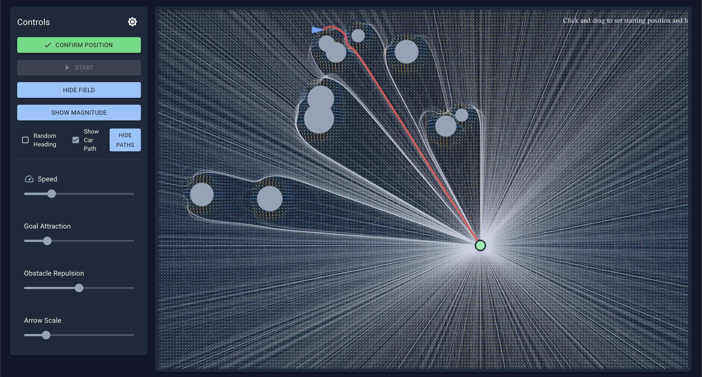

# Potential Field Path Planning Visualization

An interactive visualization tool for potential field-based path planning, built with React and Material-UI. This application demonstrates how artificial potential fields can be used for robot navigation and path planning.



## Features

### Core Functionality
- Real-time visualization of potential field-based path planning
- Interactive car (robot) and goal positioning
- Dynamic obstacle generation and placement
- Multiple path visualization modes
- Smooth car movement following potential field gradients

### Interactive Controls
- **Car Control**: Click and drag to position the car, rotate using the handle
- **Goal Control**: Click and drag to set the goal position
- **Start/Stop**: Control car's autonomous movement towards the goal
- **Speed Control**: Adjust the car's movement speed

### World Setup
- **Obstacle Generation**:
  - Random distribution
  - Uniform grid
  - Custom placement
- **Obstacle Parameters**:
  - Adjustable number (5-20)
  - Configurable size range (10-50px)
  - Regenerate world with new seed

### Visualization Options
- **Potential Field Display**:
  - Toggle field visibility
  - Show force magnitude or direction
  - Adjustable arrow scale, thickness, and size
- **Path Analysis**:
  - Show possible paths from multiple starting points
  - Auto-update paths when goal moves
  - Display current car's predicted path
  - Randomize initial heading angles

### Force Parameters
- **Goal Attraction**: Adjust the attractive force of the goal
- **Obstacle Repulsion**: Configure the repulsive force of obstacles

### Path Planning Settings
- **Grid Resolution**: Control the density of path calculations
- **Path Length Parameters**: Adjust minimum path length and significant distance
- **Angular Resolution**: Set number of angles per starting point
- **Margin Scale**: Configure the planning boundary

### UI Features
- Dark/Light theme support
- Responsive design
- Collapsible control panels
- Real-time parameter adjustments

## Technical Details

### Potential Field Algorithm
The application uses a combination of attractive and repulsive forces:
- Attractive force from the goal (linear scaling)
- Repulsive forces from obstacles (inverse square law)
- Smooth force field interpolation
- Configurable influence distances

### Path Generation
- Multi-point path sampling
- Adaptive step size
- Collision detection
- Path completion detection
- Efficient path caching and updates

### Performance Optimizations
- Debounced path updates during goal movement
- Efficient force calculations
- Optimized canvas rendering
- Smart path sampling around important areas

## Getting Started

1. Clone the repository
2. Install dependencies:
   ```bash
   npm install
   ```
3. Start the development server:
   ```bash
   npm run dev
   ```

## Usage Tips

1. **Basic Navigation**:
   - Drag the red arrow to position the car
   - Drag the green circle to set the goal
   - Use the rotation handle to orient the car

2. **Path Planning**:
   - Enable "Show Possible Paths" to see all potential routes
   - Enable "Show Current Path" to see the car's predicted path
   - Adjust grid size to change path resolution

3. **Force Field Tuning**:
   - Increase goal attraction for more direct paths
   - Increase obstacle repulsion for wider obstacle avoidance
   - Adjust field visualization to understand force distribution

4. **Performance Optimization**:
   - Reduce grid resolution for smoother updates
   - Adjust path update frequency as needed
   - Use sparse grid points for faster calculations

## Dependencies

- React
- Material-UI
- TypeScript
- HTML Canvas

## License

MIT License - feel free to use and modify for your own projects!
